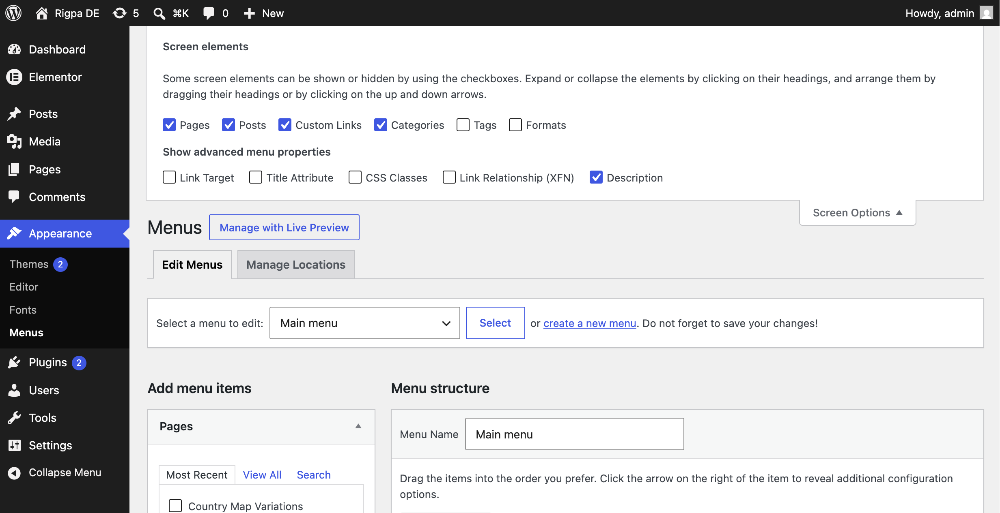
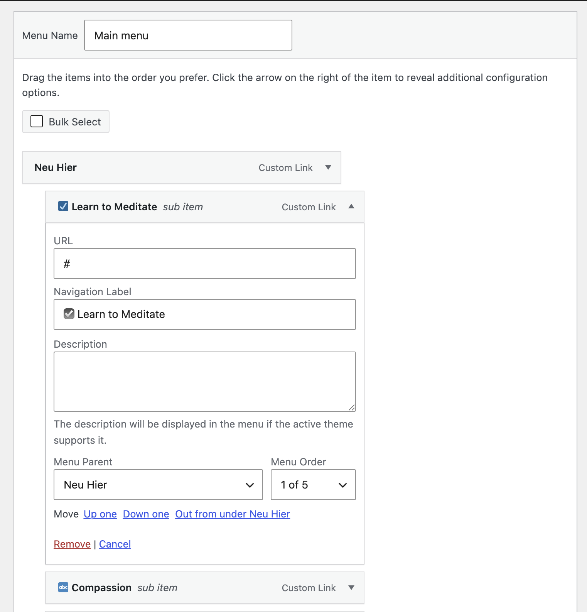

# Rigpa DE

WordPress, MySQL, and Docker Compose, with two custom plugins:

- **Rigpa.de Map** — interactive Germany locations map.
- **Rigpa Mega Menu** — standard WordPress navigation with an optional mega-menu display.

## Run locally

Install [Docker Desktop](https://www.docker.com/products/docker-desktop/), then:

```bash
cp .env.example .env
docker compose up -d
```

Wait for setup to finish:

```bash
docker compose logs wordpress-setup
```

- Site: http://localhost:8080
- Admin: http://localhost:8080/wp-admin
- Local default login: `admin` / `admin` (change it before production)

## Useful commands

| Command | Purpose |
|---|---|
| `make up` / `make down` | Start or stop the local stack |
| `make logs` | Follow container logs |
| `make setup` | Re-run WordPress setup |
| `make reset` | Delete local Docker data and start again |
| `make wp ARGS="plugin list"` | Run WP-CLI |
| `make build-map` | Build map plugin assets |
| `make build-mega-menu` | Build mega-menu assets |
| `make package-plugin` | Create `dist/rigpa-de-map.zip` |
| `make package-mega-menu` | Create `dist/rigpa-mega-menu.zip` |

## Rigpa Mega Menu

The header reads from normal WordPress menus. No shortcode, demo menu, or bundled featured images are required.

### Choose the menu display

Go to **Appearance → Menus → Manage Locations** and assign any WordPress menu to one of these locations:

- **Header Menu (standard)** — displays regular WordPress navigation.
- **Mega Menu** — displays the same menu using the interactive mega-menu header.

Each location can have one menu. Assigning another replaces the previous assignment. If both locations have menus, **Mega Menu** takes precedence.

To compare the two modes, assign your menu to **Header Menu (standard)**, then add or remove its **Mega Menu** assignment.

### Structure and featured panels

- Top-level menu items become the mega-menu section headings.
- Nested items become links in that section’s dropdown; deeper levels are included in the same panel.
- In **Tools → Mega Menu**, Featured Panels lists the top-level items from the menu assigned to **Mega Menu**. Add an image, title, description, and link there to display a right-hand panel for that section.
- Images are selected from the WordPress Media Library; the plugin provides no default images.

### Add menu descriptions

Descriptions are the grey subtitle text shown beneath dropdown links.

1. Go to **Appearance → Menus** and select the menu assigned to **Mega Menu**.
2. Open **Screen Options** in the top-right corner and tick **Description**.



3. Expand a nested menu item, fill in **Description**, and save the menu.



### Transparent headers

The default header is solid white with dark text. For a page with a dark hero image or video:

1. Edit the page or post.
2. In the **Mega Menu Header** sidebar panel, set **Header style** to **Transparent (over hero)**.
3. Leave **Menu text colour** blank for white text, or enter a hex colour for a custom contrast treatment.

Leave other pages on **Inherit** or choose **Solid**.

### Install the Mega Menu elsewhere

```bash
make package-mega-menu
```

Upload `dist/rigpa-mega-menu.zip` through **Plugins → Add New → Upload Plugin**, activate it, then create or select a menu and assign it to **Mega Menu**.

## Rigpa.de Map

Build the map plugin before using or packaging it:

```bash
make build-map
```

Add `[rigpa_de_map]` to a page or an Elementor Shortcode widget. The alias `[rigpa-de-map]` also works.

To install it elsewhere, run `make package-plugin` and upload `dist/rigpa-de-map.zip` through **Plugins → Add New → Upload Plugin**.

## Production and reuse

For production, update `.env` with real URLs, strong passwords, and unique WordPress salts, then run:

```bash
docker compose -f docker-compose.yml -f docker-compose.prod.yml up -d
```

Use a reverse proxy/TLS certificate in front of WordPress. For another site, copy the repository, create a new `.env`, and use a unique `COMPOSE_PROJECT_NAME`, `WP_URL`, and port.

## Troubleshooting

| Issue | What to do |
|---|---|
| Setup has not finished | `docker compose logs wordpress-setup` |
| Port is already in use | Change `WP_PORT` in `.env` |
| Need a clean local site | Run `make reset` |
| Plugin assets are missing | Run the relevant `make build-*` command |
